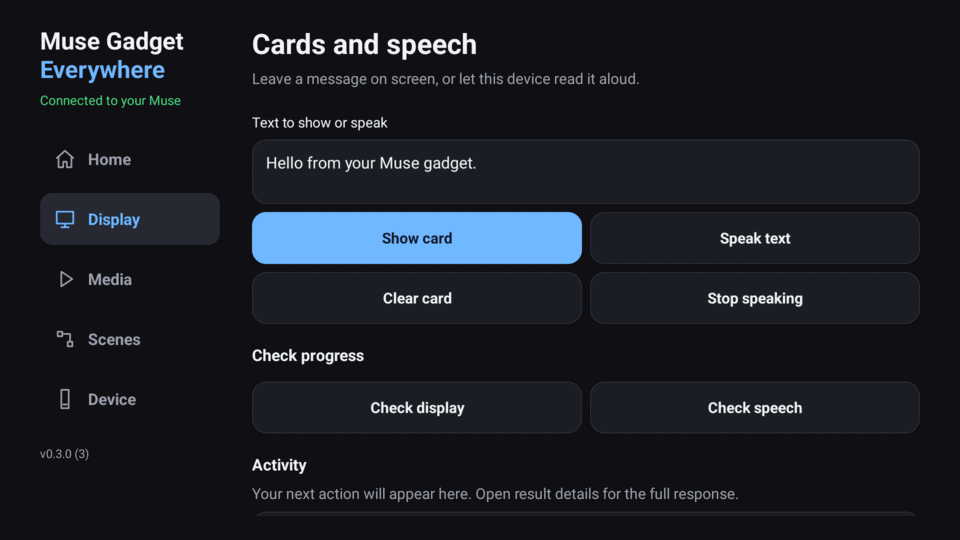
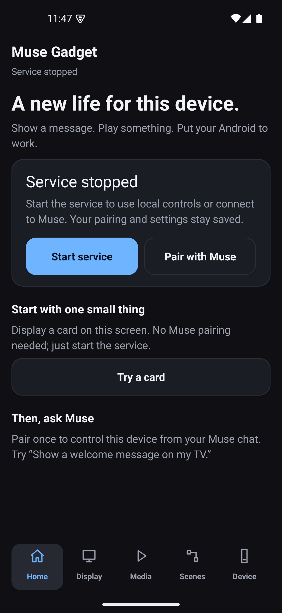

# Muse Gadget Everywhere

**Bring Muse to Android hardware.** An open-source runtime that turns Android phones, tablets and TVs into programmable Muse gadgets: display, media, voice, camera and local automation, according to each device’s capabilities. Build new uses with Kotlin and Python. No root. No Termux.

[](https://github.com/hypery11/muse-gadget-everywhere/releases/latest)
[](https://github.com/hypery11/muse-gadget-everywhere/actions/workflows/ci.yml)
[](docs/COMPATIBILITY.md)
[](LICENSE)

[**Get started**](#quick-start) · [**繁體中文**](README.zh-TW.md) · [Commands](docs/FEATURES.md) · [Ask a question](https://github.com/hypery11/muse-gadget-everywhere/discussions)


*Phone, tablet and TV layouts from 0.3.0; see [device validation](#what-is-verified) for tested hardware. [Download 0.3.0](https://github.com/hypery11/muse-gadget-everywhere/releases/tag/v0.3.0) to try this interface. Published APKs use development signing; production signing remains planned.*

## Build an Android endpoint, keep the SDK upstream

The interesting engineering boundary is small: **Kotlin owns Android hardware and lifecycle; Python owns command validation, scenes and integrations; the upstream SDK owns pairing and cloud transport.** Muse commands, local controls and scenes share one command catalog.

```sh
git clone --recurse-submodules https://github.com/hypery11/muse-gadget-everywhere.git
cd muse-gadget-everywhere
./gradlew :app:assembleDebug   # JDK 17, Android SDK 35, Python 3.11
adb install -r app/build/outputs/apk/debug/app-debug.apk
```

[Architecture & extension points](docs/ARCHITECTURE.md) · [Build prerequisites / modern runtime](docs/BUILD.md) · [Checks & first contributions](CONTRIBUTING.md)

CI builds both universal and modern development APKs with checksums. Download artifacts from a successful [Actions run](https://github.com/hypery11/muse-gadget-everywhere/actions/workflows/ci.yml) while signed into GitHub; these are development builds, not production-signed releases.

## Build around your device’s capabilities

| You want to… | Use it for… |
| --- | --- |
| Give your device a voice and a display | Message cards, images and buttons; spoken reminders with Android TTS |
| Play something | Native audio/video, queues, subtitles and playback controls; choose another Cast receiver |
| Run a small routine | Local scenes triggered manually, on a schedule or by an event while the service runs |
| Give Muse eyes and ears | Visible, opt-in camera capture and push-to-talk; on-device Chinese OCR and barcode reading |
| Connect your home | Optional Home Assistant states/events and MQTT; outgoing actions are opt-in |

The app uses the **unmodified upstream Muse Gadget SDK** for pairing and cloud communication. The Android layer adds local controls and native hardware features. This is an independent community project, not an official Muse app.

## Quick start

**Download 0.3.0:** [Universal APK — including Chromecast](https://github.com/hypery11/muse-gadget-everywhere/releases/download/v0.3.0/muse-gadget-0.3.0-universal-debug.apk) · [Modern APK — 64-bit / 16 KiB](https://github.com/hypery11/muse-gadget-everywhere/releases/download/v0.3.0/muse-gadget-0.3.0-modern-debug.apk) · [Release notes and checksums](https://github.com/hypery11/muse-gadget-everywhere/releases/tag/v0.3.0). These development-signed APKs use the same signing certificate as the published 0.2 APK. Use `adb install -r` to update without uninstalling; see [upgrade instructions](docs/GETTING_STARTED.md#install). You can also [build from source](docs/BUILD.md).

1. **Install on your Android device.** Android 7.0+ is the minimum. Use the universal build for Chromecast; devices with 16 KiB pages need the modern build. [Choose a build and connect ADB →](docs/GETTING_STARTED.md)
2. **Try it locally.** Open the app → **Start service → Try a card → Show card**. A visible message is your first success; no Muse account is needed for this step.
3. **Connect Muse when ready.** Home → **Pair with Muse**. Save an SDK token from [gadgets.muse.ai](https://gadgets.muse.ai/settings/sdk-tokens), open setup, then use the Muse phone app → Settings → Devices → Add Device. Pairing requires BLE peripheral support.
4. **Start the service after pairing.** Wait for **Connected to your Muse**. Ask Muse to show a message on your device. [Pairing help →](docs/GETTING_STARTED.md#connect-muse)

Remote commands that open screens/apps in the background also need Android overlay access: **Device → Diagnostics & setup → Grant overlay**. Camera, microphone and home integrations are optional.

## See it working



*Local control demonstration, recorded from the app. Cloud control was verified separately; this animation does not depict a Muse chat.*



The TV uses a focusable side rail; phones use bottom navigation. Display, Media, Scenes and Device tools each have their own page. Inputs survive tab changes, command responses have a readable summary, and full details remain available.

## What is verified?

Real hardware testing centers on **Chromecast with Google TV (Android 12, 32-bit userspace)**. The native runtime was also tested on Android API 24 and 35 emulators, including a 16 KiB ARM64 image. This is not a claim that every Android device has been tested.

- Chromecast: BLE pairing, Muse cloud commands, Cast playback/pause/resume/stop, TTS, display cards and reboot reconnection.
- Device/emulator regression: native media, OCR/barcodes, local scenes, lifecycle and UI navigation.
- Still needs community testing: physical phones/tablets, real Home Assistant/MQTT installations and a 72-hour soak.

[Compatibility matrix](docs/COMPATIBILITY.md) · [Validation summary](docs/VALIDATION-RESULTS.md) · [Reproduce the checks](docs/VALIDATION.md) · [Report your device](https://github.com/hypery11/muse-gadget-everywhere/issues/new?template=device_report.yml)

The 0.3 upgrade restricts file commands to an app workspace and makes the trusted developer shell opt-in. Native cryptography dependency advisories remain open; see [security boundaries](docs/SECURITY.md) for the known limits.

## Build, explore, contribute

[Build instructions](docs/BUILD.md) · [Full command guide](docs/FEATURES.md) · [Troubleshooting](docs/GETTING_STARTED.md#troubleshooting) · [Roadmap](docs/ROADMAP.md)

You can help without writing code: report a device, improve a setup step, translate a guide, or share a useful scene in [Discussions](https://github.com/hypery11/muse-gadget-everywhere/discussions). Developers can start with [CONTRIBUTING](CONTRIBUTING.md).

If this helps you build something with Android and Muse, **star the repo** to follow its development. A device report, extension or short demo helps the next person get started, too.

<details>
<summary>New to Muse?</summary>

Cloud control needs a Muse account, phone app and SDK token; [Muse SDK terms](https://gadgets.muse.ai/sdk-terms) apply. Local controls can run without pairing.

</details>

## License

[Apache-2.0](LICENSE). Upstream SDK and third-party notices are preserved; see [NOTICE](NOTICE) and [upstream integration](docs/UPSTREAM.md).
