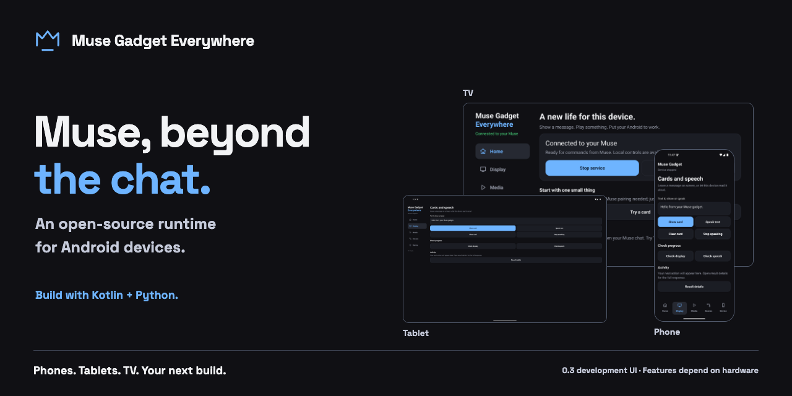

# Muse Gadget Everywhere

**把 Muse 的能力帶進 Android 裝置。** 這是一套開源執行環境，讓 Android 手機、平板與 TV 成為可程式化的 Muse 裝置：依硬體能力提供螢幕、影音、語音、相機與本機自動化，再用 Kotlin 與 Python 擴充用途。不需要 root 或 Termux。

[English](README.md) · [安裝與配對](docs/GETTING_STARTED.md) · [指令指南](docs/FEATURES.md) · [討論區](https://github.com/hypery11/muse-gadget-everywhere/discussions)



> 圖片展示 **0.3.0** 的手機、平板與 TV 版型，已測硬體請見下方驗證範圍。[下載 Universal APK（含 Chromecast）](https://github.com/hypery11/muse-gadget-everywhere/releases/download/v0.3.0/muse-gadget-0.3.0-universal-debug.apk) · [Modern APK（64 位元／16 KiB）](https://github.com/hypery11/muse-gadget-everywhere/releases/download/v0.3.0/muse-gadget-0.3.0-modern-debug.apk) · [版本說明與 SHA256](https://github.com/hypery11/muse-gadget-everywhere/releases/tag/v0.3.0)。APK 使用開發簽章，與公開 0.2 版憑證相同；正式產品簽章仍待建立。

## 給開源開發者的入口

Kotlin 負責 Android 硬體與生命週期，Python 負責指令驗證、場景與整合；上游 SDK 保持未修改，處理配對與雲端傳輸。Muse、本機控制與場景共用同一份指令目錄。

```sh
git clone --recurse-submodules https://github.com/hypery11/muse-gadget-everywhere.git
cd muse-gadget-everywhere
./gradlew :app:assembleDebug
```

需要 JDK 17、Android SDK 35 與 Python 3.11。請從[架構與擴充入口](docs/ARCHITECTURE.md)、[建置指南](docs/BUILD.md)與[第一個貢獻](CONTRIBUTING.md)開始；成功的 GitHub Actions run 會提供兩種開發版 APK 與 checksum，下載需登入 GitHub。

## 先讓它做一件有用的事

1. 下載上方 APK：Chromecast 請用 **universal**；需要 16 KiB 記憶體頁面的 ARM64/x86_64 裝置請用 **modern**。最低 Android 7.0，硬體能力另有差異。從公開 0.2 版升級時，使用 `adb install -r muse-gadget-0.3.0-universal-debug.apk` 保留資料，不必先移除 App；自行編譯或 CI 產物可能使用不同簽章，請見[升級說明](docs/GETTING_STARTED.md#install)。
2. 開啟 App → **Start service → Try a card → Show card**。先看到訊息出現在螢幕上；這一步不必配對 Muse。
3. 要遠端控制時，回首頁選 **Pair with Muse**。從 [gadgets.muse.ai](https://gadgets.muse.ai/settings/sdk-tokens) 取得 SDK token，儲存後開啟配對視窗。
4. Muse 手機 App → Settings → Devices → Add Device，完成配對後選 **Start service & open controls**。
5. 等待 **Connected to your Muse**，再請 Muse「在這台裝置顯示歡迎訊息」，有多台時指定裝置名稱。要從背景開啟畫面，需先到 **Device → Diagnostics & setup → Grant overlay** 授權。

App 目前使用英文介面，因此這份指南保留按鈕原文。完整操作與疑難排解見[入門指南](docs/GETTING_STARTED.md)。

## 可以做什麼？

| 情境 | 能力 |
| --- | --- |
| 留下提醒 | 螢幕卡片、圖片、按鈕、Android 文字朗讀 |
| 播放與控制 | 本機影音、播放佇列、字幕、暫停／繼續，搜尋並選擇 Cast 裝置 |
| 小型自動化 | 手動、排程或事件觸發的本機場景；服務需持續執行 |
| 看與聽 | 使用者可見、需操作的相機與語音輸入；離線中文 OCR 和條碼辨識 |
| 串接智慧家庭 | 可選的 Home Assistant 與 MQTT；對外動作需在裝置上啟用 |

TV 使用方向鍵側欄，手機使用底部導覽。五個分頁分開日常任務，輸入文字在切換時保留；進階 JSON 結果收在 Result details。

## 驗證範圍

目前主要實機是 **Chromecast with Google TV（Android 12、32 位元使用者空間）**。已驗證 Muse 雲端指令、BLE 配對、Cast 播放控制、朗讀、卡片與重開機重連。另有 API 24／35 與 16 KiB ARM64 模擬器驗證。

實體手機／平板、真實 Home Assistant／MQTT 環境與 72 小時長時間測試仍需要補充。原生加密依賴的已知安全公告仍開放追蹤，詳見[安全邊界](docs/SECURITY.md)。

[相容性](docs/COMPATIBILITY.md) · [驗證摘要](docs/VALIDATION-RESULTS.md) · [重現測試](docs/VALIDATION.md) · [回報你的裝置](https://github.com/hypery11/muse-gadget-everywhere/issues/new?template=device_report.yml)

## 一起擴充 Android 裝置的用途

不會寫程式也能幫忙：回報裝置相容性、改善安裝步驟、分享場景或翻譯文件。歡迎在[討論區](https://github.com/hypery11/muse-gadget-everywhere/discussions)使用英文或繁體中文；程式貢獻請看 [CONTRIBUTING](CONTRIBUTING.md)。

如果專案對你有用，歡迎 **Star** 收藏；一份成功安裝紀錄，也能幫助下一位使用者。

本專案為獨立社群作品，非 Muse 官方 App。使用未修改的上游 Gadget SDK；[Apache-2.0 授權](LICENSE)，雲端使用另受 [Muse SDK 條款](https://gadgets.muse.ai/sdk-terms)規範。
