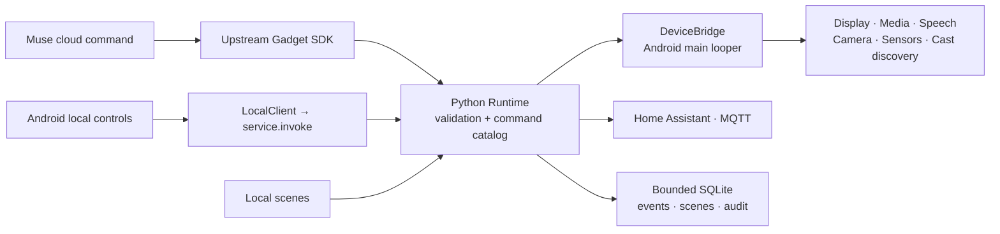

# Architecture and extension points

[Project](../README.md) · [Build](BUILD.md) · [Contribution guide](../CONTRIBUTING.md) · [Command reference](FEATURES.md)

Muse Gadget Everywhere embeds an upstream Python gadget SDK in a native Android app. The goal is to reuse the SDK’s protocol behavior while giving it Android capabilities and local controls. The SDK is a Git submodule and remains unmodified.

## Follow one command



Pairing/cloud transport runs through the unchanged SDK and the Android-specific cloud adapter. `GadgetService` owns one in-process runtime. Native UI/media operations reach Android’s main looper; blocking Python, network, file and vision work runs off the UI thread.

## Read these files first

| Concern | Entry point |
| --- | --- |
| Task UI, drafts and navigation | [ControlActivity.kt](../app/src/main/java/ai/muse/gadgeteverywhere/ControlActivity.kt) |
| Android service and lifecycle | [GadgetService.kt](../app/src/main/java/ai/muse/gadgeteverywhere/GadgetService.kt) |
| Shared local command entry | [LocalClient.kt](../app/src/main/java/ai/muse/gadgeteverywhere/LocalClient.kt), [service.py](../app/src/main/python/androidtv/service.py) |
| Catalog and validation | [commands.py](../app/src/main/python/androidtv/commands.py), [runtime.py](../app/src/main/python/androidtv/runtime.py) |
| Native hardware bridge | [DeviceBridge.kt](../app/src/main/java/ai/muse/gadgeteverywhere/DeviceBridge.kt) |
| Scenes, delivery queue and audit | [events.py](../app/src/main/python/androidtv/events.py) |
| App-owned files and limits | [workspace.py](../app/src/main/python/androidtv/workspace.py) |
| Home Assistant / MQTT | [integrations.py](../app/src/main/python/androidtv/integrations.py) |
| BLE and pairing adaptation | [BleTransport.kt](../app/src/main/java/ai/muse/gadgeteverywhere/BleTransport.kt), [pairing.py](../app/src/main/python/androidtv/pairing.py) |
| Upstream cloud adaptation | [cloud.py](../app/src/main/python/androidtv/cloud.py), [UPSTREAM.md](UPSTREAM.md) |

## Small example: a local display command

Inside an Activity, after the gadget service is running:

```kotlin
LocalClient.execute(
    this,
    "screen.show",
    JSONObject().put("title", "Hello").put("text", "From Android and Python"),
) { result ->
    // Inspect ok/error. An accepted job is not proof that it rendered.
}
```

Call `screen.status` to observe the rendered state. This is an in-app API example, not an unauthenticated HTTP endpoint. The UI exercises the same validation path used by the cloud and scenes.

## Add a capability without forking the SDK

1. Define a strict command schema and its catalog entry in the Android overlay.
2. Implement dispatch in the runtime; place Android-only work behind the native bridge.
3. Report capability and permission readiness honestly. Unsupported hardware must produce an actionable result.
4. Add behavior tests for validation, success, failure and relevant bounds. Use the host tests for pure Python; add instrumentation when correctness depends on the packaged runtime or Android.
5. Document the command, limits and observed device results. Keep async acceptance separate from completion.

Do not edit `vendor/`, add permissions without a user-facing reason, or expose a native shortcut that bypasses the shared validation path. Workspace confinement does not isolate a trusted shell once the user explicitly enables it.

## Useful first PRs

- **Setup documentation:** reproduce one install path on a physical device and add only the differing steps plus device/API/ABI evidence.
- **Pure Python boundary test:** add a meaningful regression case in `app/src/main/python/androidtv/tests/` for a documented edge case that lacks coverage.
- **Device report:** verify BLE peripheral behavior and local-card flow on a physical phone/tablet; no Kotlin knowledge needed.
- **Localization proposal:** extract remaining diagnostic labels before adding a complete locale. The current app UI is English; the Traditional Chinese README is documentation, not a translated UI.

Check current issues before starting. Maintainers should promote one of these to `good first issue` only after adding exact scope, acceptance criteria and a reproducible fixture.

## Build and test boundaries

The universal Python 3.11 build retains 32-bit Chromecast compatibility. The Python 3.13 modern build supplies 64-bit/16 KiB native compatibility. They share one package name and output paths, so copy artifacts before switching variants.

Default instrumentation isolates cloud traffic to avoid rotating a real account’s credentials during lifecycle stress tests. Use [VALIDATION.md](VALIDATION.md) for the separate, explicit cloud procedure. [Security boundaries](SECURITY.md), [compatibility evidence](COMPATIBILITY.md) and [the roadmap](ROADMAP.md) describe the remaining work.
